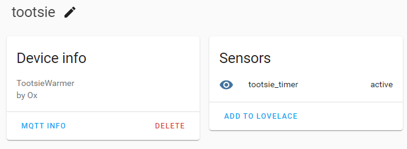

# tootsie_warmer

Arudino controlled boot warmer using a Wemos D1 mini (ESP8266 variant) that can be controlled by Home Assitant over MQTT.

Pretend the LED is a relay that switches on the boot warmer

The circuit diagram for this is

## How does it work - Physical

* Pressing `SW_Add` (the lefthand button in the prototype) will add 15 minutes to a timer
* Pressing `SW_stop` will clear the timer and turn off the LED

## MQTT & Home Assistant

All communications happen over MQTT.

### Sensor Discovery

The device shows up in home assistant as a sensor in the active or idle states.

It has attributes of `duration` and `remaining` showing how long is left.  These fit really well with the [Lovelace Timer Bar Card](https://github.com/rianadon/timer-bar-card).  There is a weird thing with the timer bar card that it loses between 5 and 10 seconds due to how it works out time remaining.  I might fix this in https://github.com/oxo42/tootsie_warmer/issues/1

### Setting the timer remotely

Sending an integer to the MQTT topic `homeassistant/sensor/tootsie/set` will set the timer to that many seconds.  Once this is all hooked up, I intend HASS to send 3600s at 7am, just in time for me to leave at 8.

## But why?

I want to overengineer my boot warmer so that [Home Assistant](https://www.home-assistant.io/) can turn it on for me at 7am and I have warm ski boots at 8am. My intention is to pull the spring based timer out of a set of boot warmer and replace it with an arduino that controls a relay.

### Would it have been simpler to bypass the spring switch and use an off the shelf smart plug to control it?

You're not my friend any more, go away!

## Hardware gotchas

### Pin D8 cannot be held high at boot

At one point I had pin D8 connected to a pin on the LCD1602 that was high at boot and caused the boot to fail.

## References

* [ESP8266 Pinout Reference](https://randomnerdtutorials.com/esp8266-pinout-reference-gpios/)
* [Timer Bar Card](https://github.com/rianadon/timer-bar-card)
